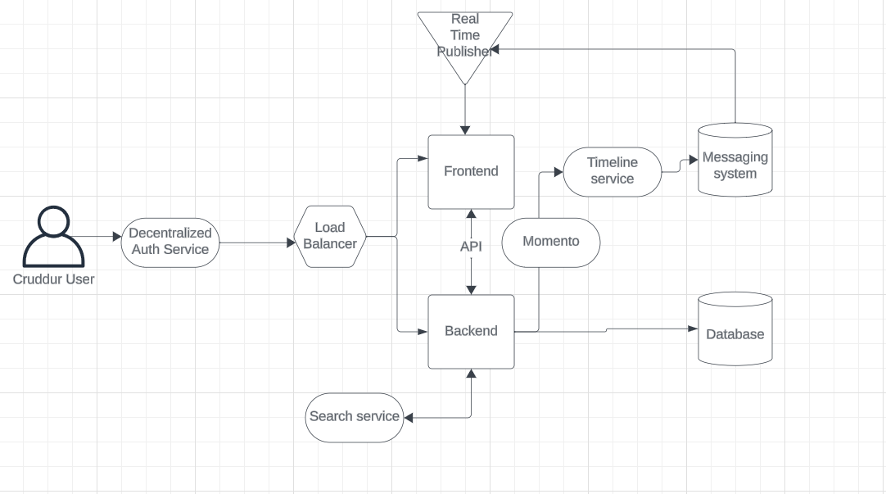
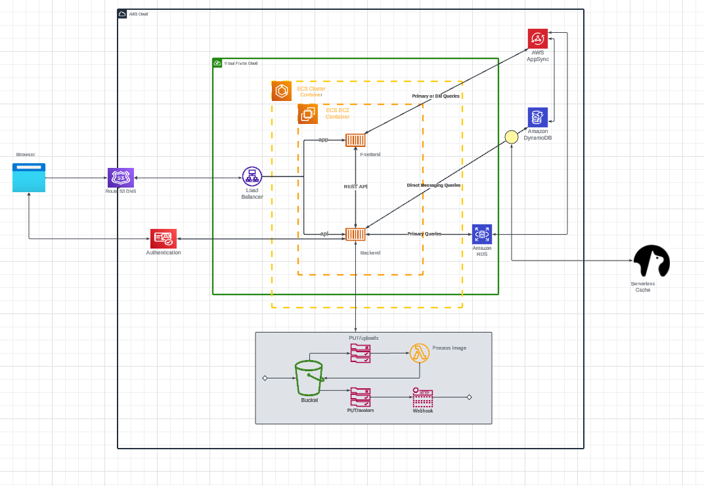
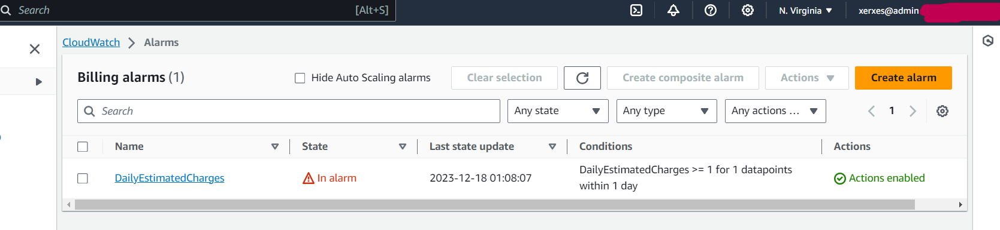
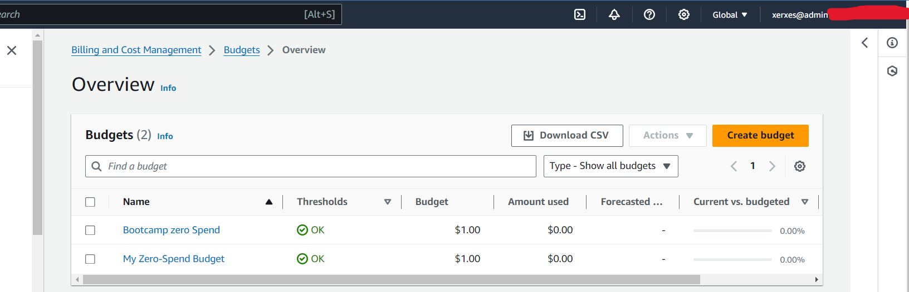

# Week 0 — Billing and Architecture

## Required Homework

### 1. Recreate Conceptual Diagram in Lucid Charts
[Lucid charts Cruddur Conceptual diagram](https://lucid.app/lucidchart/e2c17852-e646-47e9-9c2e-a505dcb38f2d/edit?viewport_loc=-280%2C-125%2C2237%2C1236%2C0_0&invitationId=inv_6bb0fe62-f6bb-434f-a6db-6b26e20b7c7c)  


### 2.  Recreate Logical Diagram in Lucid Charts
[Lucid charts Cruddur Logical diagram](https://lucid.app/lucidchart/2ae356f2-1b4c-4789-9360-b2eeffef69c8/edit?view_items=KRzXGNWUJnWM&invitationId=inv_a7c99550-d4fa-4b01-a757-42c6780c9e83)  


###  3. Create an Admin User

i. Log into your AWS account as **Root User**  
ii. Go to [IAM user console](https://us-east-1.console.aws.amazon.com/iam/home?region=us-east-1#/users) and click ``create user``  
iii. Ensure that you ``Enable Console access`` for this user 
iv. Add user to ``Admin group`` if it exists or create a new group and attach ``AdministratorAccess`` policy to the new group  
v. Review the new user's details and then click **Create User**.  
vi. Easily retrieve password and user details by downloading the .csv file


### 4. Use Cloudshell

i. Sign in as a user and click on the Cloudshell icon as indicated on the image below  


ii. For example, if we want to get contact information of our AWS account, we can enter the following command  

``aws account get-contact-information --account-id <value>``  

The above command will display the address that was used when the AWS  account was created  
Get all the AWS  CLI commands on [here](https://awscli.amazonaws.com/v2/documentation/api/latest/reference/index.html#cli-aws)  

### 5. Generate AWS Credentials

i. Sign in as an Admin User  
ii. Go to [IAM user console](https://us-east-1.console.aws.amazon.com/iam/home?region=us-east-1#/users) and click on the ``User name``  
iv. Click on the ``Security Credentials`` tab  
v. Go to the ``Access Keys`` box and click ``create access key``  
vi. Choose ``AWS CLI Access`` on the access type and generate new credentials  
vii. Easily save the created ACCESS KEY and ACCESS KEY ID by downloading the .csv file.  

### 6. Install AWS CLI

1. The newly generated AWS credentials, and AWS account ID need to saved as environment variables in gitpod ( our cloud development environment for the bootcamp)  
   i. Setting an env variable  
   ``gp env AWS_ACCOUNT_ID=<value>``  
   ``gp env AWS_ACCESS_ID=<value>``  
   ``gp env AWS_ACCESS_KEY=<value>``  

   ii. Exporting to gitpod  
   ``export AWS_ACCOUNT_ID=<value>``  
   ``export AWS_ACCESS_ID=<value>``  
   ``exportAWS_ACCESS_KEY=<value>``
   
3. To automate the installation of the AWS CLI each time we open the project Github repo in gitpod, we create a yaml file **.gitpod.yml** and write the following code  
```yml
tasks:
  - name: aws-cli
    env:
      AWS_CLI_AUTO_PROMPT: on-partial
    init: |
      cd /workspace
      curl "https://awscli.amazonaws.com/awscli-exe-linux-x86_64.zip" -o "awscliv2.zip"
      unzip awscliv2.zip
      sudo ./aws/install
      cd $THEIA_WORKSPACE_ROOT
vscode:
  extensions:
    - 42Crunch.vscode-openapi
   ```

### 7. Create Billing Alarm

i. First create an SNS topic which will generate a ``Topic ARN``  
[aws sns create-topic](https://awscli.amazonaws.com/v2/documentation/api/latest/reference/sns/create-topic.html#examples)  

``aws sns create-topic --name billing_alarm``  

ii. Use the generated Topic ARN and your email to subscribe  
```
aws sns subscribe \  
    --topic-arn arn:aws:sns:us-west-2:123456789012:my-topic \  
    --protocol email \  
    --notification-endpoint your-email@example.com  
```
iii. Confirm subscription in the provide email  
iv. [Create an alarm configuration as a JSON file](https://repost.aws/knowledge-center/cloudwatch-estimatedcharges-alarm)  
v. Call the **PutMetricAlarm API**  
``aws cloudwatch put-metric-alarm --cli-input-json file://aws/json/alarm-config.json``  



### 8. Create Budget
i. Copy and modify budget configuration ``budget.json`` and notification with subscriber configuration ``notifications-with-subscribers.json`` from [aws create-budget](https://awscli.amazonaws.com/v2/documentation/api/latest/reference/budgets/create-budget.html#examples)    
ii. Run the command 
```
aws budgets create-budget \
    --account-id 111122223333 \
    --budget file://aws/json/budget.json \
    --notifications-with-subscribers file://aws/json/budget-notifications.json
```

