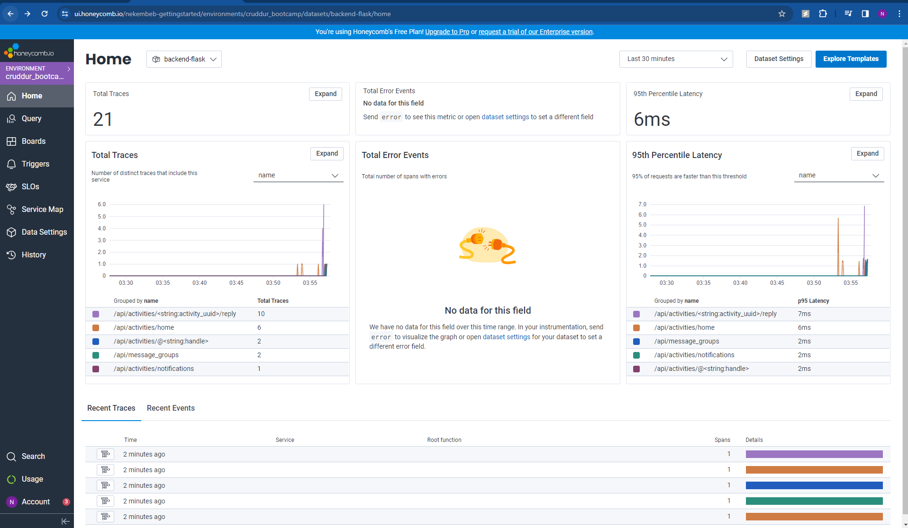
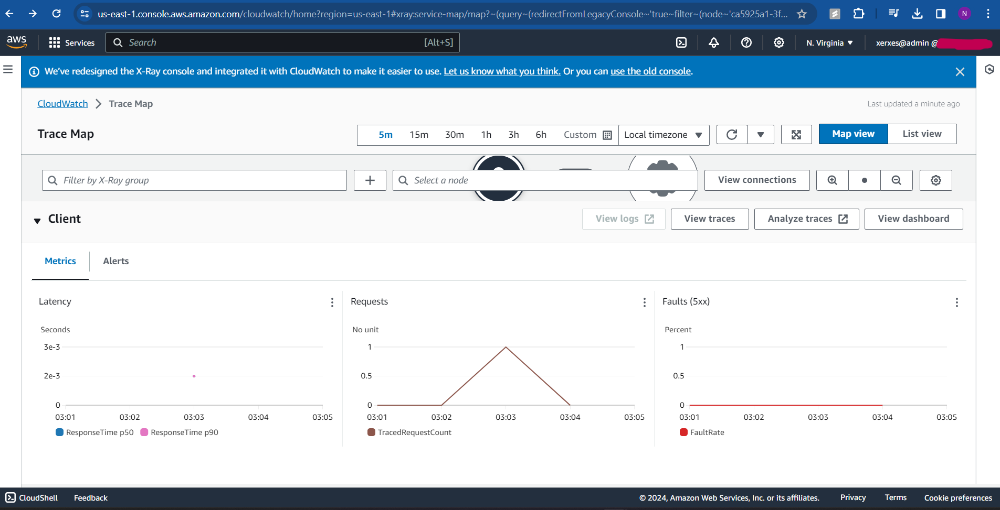
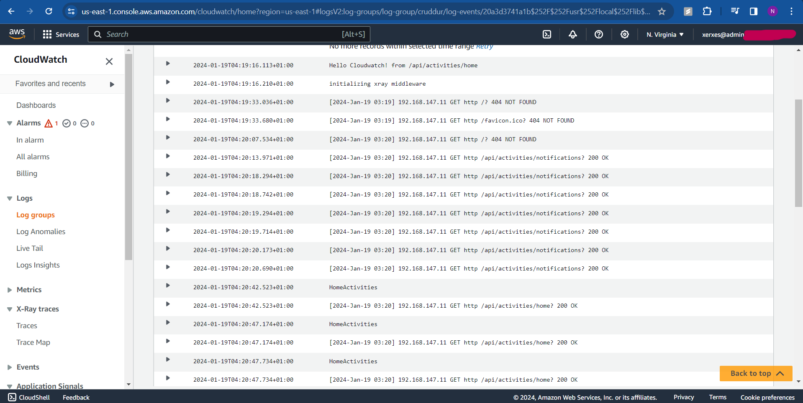
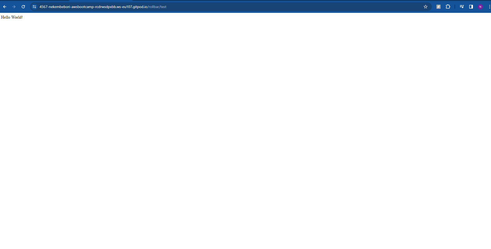
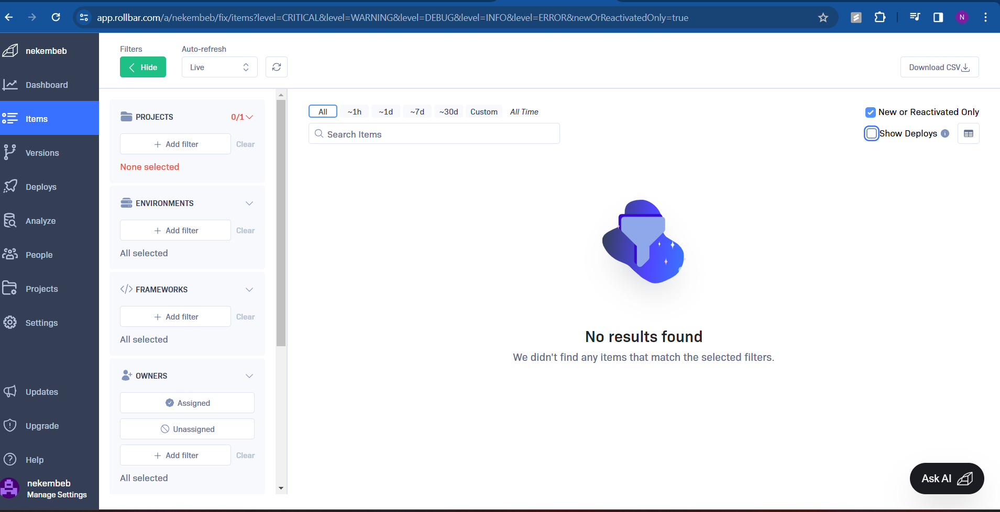

# Week 2 — Distributed Tracing

## Required Homework
### HoneyComb
Get the api key from your Honeycomb account after creating a new environment and set the following env vars in gitpod  
```sh
export HONEYCOMB_API_KEY=""
export HONEYCOMB_SERVICE_NAME="Cruddur"
gp env HONEYCOMB_API_KEY=""
gp env HONEYCOMB_SERVICE_NAME="Cruddur"
```

#### Instrument OpenTelemetry to use Honeycomb.io as provider
Append the following env vars to the backend flask in the docker compose file  
```
OTEL_SERVICE_NAME: "backend-flask"
OTEL_EXPORTER_OTLP_ENDPOINT: "https://api.honeycomb.io"
OTEL_EXPORTER_OTLP_HEADERS: "x-honeycomb-team=${HONEYCOMB_API_KEY}"
```

Add the following packages to the requirements.txt (in the backend-flask dir) for installation
```
opentelemetry-api 
opentelemetry-sdk 
opentelemetry-exporter-otlp-proto-http 
opentelemetry-instrumentation-flask 
opentelemetry-instrumentation-requests
```

Add to ``app.py``  
```py
from opentelemetry import trace
from opentelemetry.instrumentation.flask import FlaskInstrumentor
from opentelemetry.instrumentation.requests import RequestsInstrumentor
from opentelemetry.exporter.otlp.proto.http.trace_exporter import OTLPSpanExporter
from opentelemetry.sdk.trace import TracerProvider
from opentelemetry.sdk.trace.export import BatchSpanProcessor
```
```py
# Initialize tracing and an exporter that can send data to Honeycomb
provider = TracerProvider()
processor = BatchSpanProcessor(OTLPSpanExporter())
provider.add_span_processor(processor)
trace.set_tracer_provider(provider)
tracer = trace.get_tracer(__name__)
```
```py
# Initialize automatic instrumentation with Flask
app = Flask(__name__)
FlaskInstrumentor().instrument_app(app)
RequestsInstrumentor().instrument()
```
> To avoid errors, exclude the ``app = Flask(__name__)`` line since it's already present in your code. Just paste the remaining code under the ``app = Flask(__name__)``



### XRay
#### Instrument AWS X-Ray for Flask
Move to backend-flask directory  
``cd backend-flask``  

Add to the requirements.txt file
``aws-xray-sdk``  

To install all python dependencies run
``pip install -r requirments.txt``

In ``app.py`` add
```py
from aws_xray_sdk.core import xray_recorder
from aws_xray_sdk.ext.flask.middleware import XRayMiddleware

xray_url = os.getenv("AWS_XRAY_URL")
xray_recorder.configure(service='Cruddur', dynamic_naming=xray_url)
XRayMiddleware(app, xray_recorder)
```

#### Set up AWS X-Ray Resources
In a new file **xray.json** in aws/json
```json
{
  "SamplingRule": {
      "RuleName": "Cruddur",
      "ResourceARN": "*",
      "Priority": 9000,
      "FixedRate": 0.1,
      "ReservoirSize": 5,
      "ServiceName": "backend-flask",
      "ServiceType": "*",
      "Host": "*",
      "HTTPMethod": "*",
      "URLPath": "*",
      "Version": 1
  }
}
```
In aws-cli bash terminal run the following command to create a group
```aws xray create-group    --group-name "Cruddur"    --filter-expression "service(\"backend-flask\")"```  

Next create an X-Ray sampling rule
```aws xray create-sampling-rule --cli-input-json file://aws/json/xray.json```

#### Install X-Ray Deamon
Create a Deamon image on the Docker compse file
```yml
  xray-daemon:
    image: "amazon/aws-xray-daemon"
    environment:
      AWS_ACCESS_KEY_ID: "${AWS_ACCESS_KEY_ID}"
      AWS_SECRET_ACCESS_KEY: "${AWS_SECRET_ACCESS_KEY}"
      AWS_REGION: "us-east-1"
    command:
      - "xray -o -b xray-daemon:2000"
    ports:
      - 2000:2000/udp
```

Add the following env vars to the backend-flask [services] in the docker-compse.yml file
```yml
      AWS_XRAY_URL: "*4567-${GITPOD_WORKSPACE_ID}.${GITPOD_WORKSPACE_CLUSTER_HOST}*"
      AWS_XRAY_DAEMON_ADDRESS: "xray-daemon:2000"
```


### CloudWatch Logs
Add to the **requirements.txt** file  
```watchtower```
Install dependences  
```pip install -r requirments.txt```

We'll log something in an API endpoint
```py
LOGGER.info('Hello Cloudwatch! from  /api/activities/home')
```

Set the env var in your backend-flask for `docker-compose.yml`

```yml
      AWS_DEFAULT_REGION: "${AWS_DEFAULT_REGION}"
      AWS_ACCESS_KEY_ID: "${AWS_ACCESS_KEY_ID}"
      AWS_SECRET_ACCESS_KEY: "${AWS_SECRET_ACCESS_KEY}"
```



### Rollbar

Add to `requirements.txt`

```
blinker
rollbar
```

Install dependencies

```sh
pip install -r requirements.txt
```

Set access token
We need to set our access token

```sh
export ROLLBAR_ACCESS_TOKEN=""
gp env ROLLBAR_ACCESS_TOKEN=""
```

#### Consideration
I was unable to properly implement Rollbar even with the updated code

Successfully Received rollbar test message


Did not receive any Log on the Rollbar Dashboard

